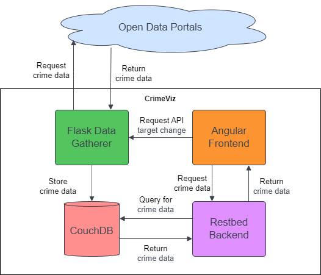

# CrimeViz

CrimeViz is a a visualization application. It's purpose is to visualize crime data from different cities in the US. It consists of multiple separate projects, each written in a programming language.

# Rough Overview

The CouchDB contains all the crime data for the application. 
The Flask Gatherer component is a Python project based on the Flask framework. It receives requests from the Angular Frontend signalling which city's API should be targeted for data. It then sends a request to the target API to get the crime data, after which it stores said data in the CouchDB. 
The Restbed Backend is a C++ project based on the Restbed framework. It receives requests from the Angular Frontend to fetch the crime data from the CouchDB and send it in the response. 
The Angular Frontend is a TypeScript project based on the Angular framework. It interacts with the Flask Gatherer to tell it which API to target and with the Restbed Backend to retrieve the crime data. It then utilizes the D3.js library to visualize the data. 

Here are the documentation files to each component:

- **[CouchDB Database](./02_couchdb_database/README.md)** 
- **[Flask Gatherer](./03_flask_gatherer/README.md)** 
- **[Restbed Backend](./04_restbed_backend/README.md)** 
- **[Angular Frontend](./05_angular_frontend/README.md)** 