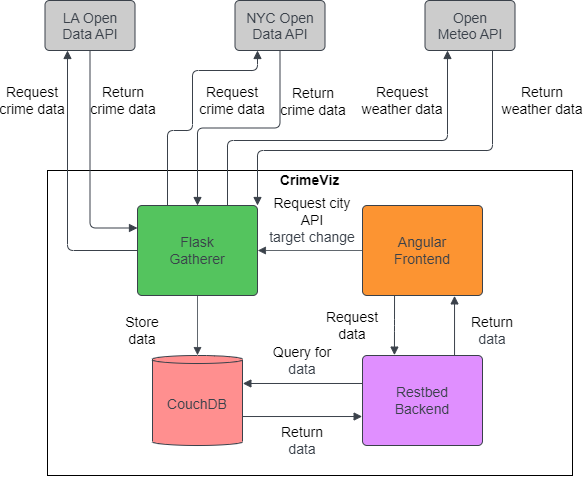
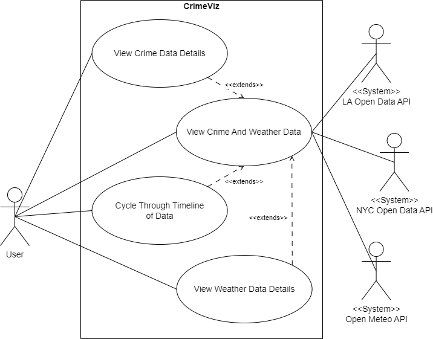

# Software Design

This file contains the general documentation to CrimeViz. This includes functional requirements, non-functional requirements, and architectural diagrams and descriptions.

## Table of Contents
1. **[Goal](#goal)** 
2. **[Rough Overview](#rough-overview)** 
3. **[Requirements](#requirements)** 
  3.1 **[Functional Requirements](#functional-requirements)** 
  3.2 **[Non-Functional Requirements](#non-functional-requirements)** 
4. **[Use Cases](#use-cases)** 
  4.1 **[Use Case Diagram](#use-case-diagram)** 
  4.2 **[Use Case Description](#use-case-description)** 

# Goal

CrimeViz is a a visualization application. It's purpose is to visualize crime data from different cities in the US. Currently it only displays data from LA and NYC. It consists of multiple separate projects, each written in a programming language.

# Rough Overview

The CouchDB contains all the crime data for the application. 
The Flask Gatherer component is a Python project based on the Flask framework. It receives requests from the Angular Frontend signalling which city's API should be targeted for data. It then sends a request to the target API to get the crime data and to the Open Meteo API to get the weather data. After this it stores said data in the CouchDB. 
The Restbed Backend is a C++ project based on the Restbed framework. It receives requests from the Angular Frontend to fetch the crime data from the CouchDB and send it in the response. 
The Angular Frontend is a TypeScript project based on the Angular framework. It interacts with the Flask Gatherer to tell it which API to target and with the Restbed Backend to retrieve the crime data. It then utilizes the D3.js library to visualize the data. 

Here are the documentation files to each component:

- **[CouchDB Database](./02_couchdb_database/README.md)** 
- **[Flask Gatherer](./03_flask_gatherer/README.md)** 
- **[Restbed Backend](./04_restbed_backend/README.md)** 
- **[Angular Frontend](./05_angular_frontend/README.md)** 

# Requirements

There are general non-functional requirements for CrimeViz. The project-specific requirements can be found in their individual documentation files linked above.

## Non-Functional Requirements

| ID        	 | Title                          | Description																		   |
| -------------- | ------------------------------ | ------------------------------------------------------------------------------------------------------------------------------------------------------ |
| CrimeViz_General_NFR_1 | Containerized Projects 	  | Each project belonging to the CrimeViz application should be containerized using Docker to guarantee cross-platform portability. A docker-compose file should tie all the individual containers together.  |

## Use Case Diagram

Five use cases have been identified for the application. All of which are triggered by the user as the primary actor. 
View Crime Data relies on the LA Open Data API and NYC Open Data API to fetch the crime data. Similarly, View Weather Data relies on the Open Meteo API to fetch the weather data that is to be displayed. 
View Crime Data Details, View Weather Data Details, and Cycle Through Timeline of Data do not rely on the APIs since these use cases can only be triggered once the other two, described above, have been triggered (hence the extends-relationship). 

## Use Case Descriptions

<table>
	<tbody>
	<tr>
		<td>Title</td>
		<td>View Crime Data</td>
	</tr>
	<tr>
		<td>Description</td>
		<td>The user selects the city for which they want to view the crime data. The crime data is fetched from either the LA Open Data API or the NYC Open Data API</td>
	</tr>
	<tr>
		<td>Actor(s)</td>
		<td>User, City Open Data API</td>
	</tr>
	<tr>
		<td>Goal</td>
		<td>Display of crime data for a city on a map</td>
	</tr>
	<tr>
		<td>Preconditions(s)</td>
		<td>CrimeViz is up and running. The user has it open in a browser</td>
	</tr>
	<tr>
		<td>Basic Flow</td>
		<td>
			<ol type="1">
				<li>The user selects the tab for the city</li>
				<li>The Angular Frontend sends an HTTP POST request containing the city for which the crime data should be gathered to the Flask Gatherer
					<ol type="i">
            			<li>The Flask Gatherer sends an HTTP GET request to the open data portal of the desired city to get the crime data
              				<ol type="a">
								<li>The open data portal responds with a status code 200 and the requested crime data</li>
							</ol>
            			</li>
            			<li>The Flask Gatherer sends an HTTP GET request to the CouchDB, requesting the latest crime data object for the city
              				<ol type="a">
								<li>The CouchDB responds with a status code 200 and the latest crime data object</li>
							</ol>
            			</li>
            			<li>The Flask Gatherer transforms the crime data that is newer than the latest crime data object fetched from CouchDb into a uniform format</li>
            			<li>The Flask Gatherer sends an HTTP POST request, containing the transformed crime data, to the CouchDB
              				<ol type="a">
								<li>The CouchDB responds with a status code 201</li>
							</ol>
            			</li>
						<li>The Flask Gatherer sends a response with status code 200 to the Angular Frontend</li>
					</ol>
				</li>
        		<li>The Angular Frontend sends an HTTP GET request containing the city for which the crime data should be fetched to the Restbed Backend
					<ol type="i">
            			<li>The Restbed Backend sends an HTTP GET request to the CouchDB
              				<ol type="a">
								<li>The CouchDB responds with a status code 200 and the requested crime data</li>
							</ol>
            			</li>
						<li>The Restbed Backend sends a response with status code 200 to the Angular Frontend</li>
					</ol>
				</li>
        		<li>The Angular Frontend displays the crime data on the corresponding map</li>
			</ol>
		</td>
	</tr>
	<tr>
		<td>Post Condition(s)</td>
		<td>The crime data in the CouchDB is up-to-date. The crime data is displayed on a map for the user</td>
	</tr>
	<tr>
		<td>Alternative Flow(s)</td>
		<td>
			In 2.i.a: The open data portal responds with a status code 202
			<ol type="1">
				<li>The Flask Gatherer retries the request three more times in intervals of three seconds
					<ol type="i">
						<li>In case of a successful request (status code 200), Flask Gatherer continues - back to 2.i.a in the basic flow</li>
						<li>In case all the attempts fail, Flask Gatherer sends a status code 500 and some information on the error to the Angular Frontend
							<ol type="a">
								<li>Angular Frontend displays an error message to the user - proceed with 3 in the basic flow</li>
							</ol>
						</li>
					</ol>
				</li>
			</ol> 
      		In 2.i.a: The open data portal responds with a status code 503
			<ol type="1">
				<li>The Flask Gatherer retries the request three more times in intervals of three seconds
					<ol type="i">
						<li>In case of a successful request (status code 200), Flask Gatherer continues - back to 2.i.a in the basic flow</li>
						<li>In case all the attempts fail, Flask Gatherer sends a status code 503 and some information on the error to the Angular Frontend
							<ol type="a">
								<li>Angular Frontend displays an error message to the user - proceed with 3 in the basic flow</li>
							</ol>
						</li>
					</ol>
				</li>
			</ol> 
			In 2.i.a: The open data portal responds with a status code 400, 401, 403, 404, 429, or 500
			<ol type="1">
				<li>The Flask Gatherer sends an identical status code and some information on the error to the Angular Frontend
					<ol type="i">
						<li>Angular Frontend displays an error message to the user - proceed with 3 in the basic flow</li>
					</ol>
				</li>
			</ol> 
      		In 2.ii.a: The CouchDB responds with a status code 503
			<ol type="1">
				<li>The Flask Gatherer retries the request three more times in intervals of three seconds
					<ol type="i">
						<li>In case of a successful request (status code 200), Flask Gatherer continues - back to 2.ii.a in the basic flow</li>
						<li>In case all the attempts fail, Flask Gatherer sends a status code 503 and some information on the error to the Angular Frontend
							<ol type="a">
								<li>Angular Frontend displays an error message to the user - proceed with 3 in the basic flow</li>
							</ol>
						</li>
					</ol>
				</li>
			</ol> 
			In 2.ii.a: The CouchDB responds with a status code 404
			<ol type="1">
				<li>The Flask Gatherer transforms all the crime data into a uniform format - proceed with 2.iii in the basic flow</li>
			</ol> 
			In 2.ii.a: The CouchDB responds with a status code 400, 401, 403, 405, 406, 409, 412, 413, 415, 416, 417, or 500
			<ol type="1">
				<li>The Flask Gatherer sends an identical status code and some information on the error to the Angular Frontend
					<ol type="i">
						<li>Angular Frontend displays an error message to the user - proceed with 3 in the basic flow</li>
					</ol>
				</li>
			</ol> 
			In 2.iv.a: The CouchDB responds with a status code 503
			<ol type="1">
				<li>The Flask Gatherer retries the request three more times in intervals of three seconds
					<ol type="i">
						<li>In case of a successful request (status code 201), Flask Gatherer continues - back to 2.iv.a in the basic flow</li>
						<li>In case all the attempts fail, Flask Gatherer sends a status code 503 and some information on the error to the Angular Frontend
							<ol type="a">
								<li>Angular Frontend displays an error message to the user - proceed with 3 in the basic flow</li>
							</ol>
						</li>
					</ol>
				</li>
			</ol> 
			In 2.iv.a: The CouchDB responds with a status code 400, 401, 403, 404, 405, 406, 409, 412, 413, 415, 416, 417, or 500
			<ol type="1">
				<li>The Flask Gatherer sends an identical status code and some information on the error to the Angular Frontend
					<ol type="i">
						<li>Angular Frontend displays an error message to the user - proceed with 3 in the basic flow</li>
					</ol>
				</li>
			</ol> 
			In 3.i.a: The CouchDB responds with a status code 503
			<ol type="1">
				<li>The Restbed Backend retries the request three more times in intervals of three seconds
					<ol type="i">
						<li>In case of a successful request (status code 200), Restbed Backend continues - back to 3.i.a in the basic flow</li>
						<li>In case all the attempts fail, Restbed Backend sends a status code 503 and some information on the error to the Angular Frontend
							<ol type="a">
								<li>Angular Frontend displays an error message to the user - end of the basic flow</li>
							</ol>
						</li>
					</ol>
				</li>
			</ol> 
			In 3.i.a: The CouchDB responds with a status code 400, 401, 403, 404, 405, 406, 409, 412, 413, 415, 416, 417, or 500
			<ol type="1">
				<li>The Restbed Backend sends an identical status code and some information on the error to the Angular Frontend
					<ol type="i">
						<li>Angular Frontend displays an error message to the user - end of the basic flow</li>
					</ol>
				</li>
			</ol> 
		</td>
	</tbody>
</table> 

<table>
	<tbody>
	<tr>
		<td>Title</td>
		<td>View Weather Data</td>
	</tr>
	<tr>
		<td>Description</td>
		<td>The user selects the city for which they want to view the weather data. The weather data is fetched from the Open Meteo API</td>
	</tr>
	<tr>
		<td>Actor(s)</td>
		<td>User, Open Meteo API</td>
	</tr>
	<tr>
		<td>Goal</td>
		<td>Display of weather data for a city on a map</td>
	</tr>
	<tr>
		<td>Preconditions(s)</td>
		<td>Use Case 'View Crime Data' has been completed</td>
	</tr>
	<tr>
		<td>Basic Flow</td>
		<td>
			<ol type="1">
				<li>The Angular Frontend sends an HTTP POST request containing the city for which the weather data should be gathered to the Flask Gatherer
					<ol type="i">
            			<li>The Flask Gatherer sends an HTTP GET request to the Open Meteo API for the weather data of the desired city
              				<ol type="a">
								<li>The Open Meteo API responds with a status code 200 and the requested weather data</li>
							</ol>
            			</li>
            			<li>The Flask Gatherer sends an HTTP GET request to the CouchDB, requesting the latest weather data object for the city
              				<ol type="a">
								<li>The CouchDB responds with a status code 200 and the latest weather data object</li>
							</ol>
            			</li>
            			<li>The Flask Gatherer transforms the weather data that is newer than the latest weather data object fetched from CouchDb into a uniform format</li>
            			<li>The Flask Gatherer sends an HTTP POST request, containing the transformed weather data, to the CouchDB
              				<ol type="a">
								<li>The CouchDB responds with a status code 201</li>
							</ol>
            			</li>
						<li>The Flask Gatherer sends a response with status code 200 to the Angular Frontend</li>
					</ol>
				</li>
        		<li>The Angular Frontend sends an HTTP GET request containing the city for which the weather data should be fetched to the Restbed Backend
					<ol type="i">
            			<li>The Restbed Backend sends an HTTP GET request to the CouchDB
              				<ol type="a">
								<li>The CouchDB responds with a status code 200 and the requested weather data</li>
							</ol>
            			</li>
						<li>The Restbed Backend sends a response with status code 200 to the Angular Frontend</li>
					</ol>
				</li>
        		<li>The Angular Frontend displays the weather data on the corresponding map</li>
			</ol>
		</td>
	</tr>
	<tr>
		<td>Post Condition(s)</td>
		<td>The weather data in the CouchDB is up-to-date. The weather data is displayed on a map for the user</td>
	</tr>
	<tr>
		<td>Alternative Flow(s)</td>
		<td>
      		In 1.i.a: The Open Meteo API responds with a status code 503
			<ol type="1">
				<li>The Flask Gatherer retries the request three more times in intervals of three seconds
					<ol type="i">
						<li>In case of a successful request (status code 200), Flask Gatherer continues - back to 1.i.a in the basic flow</li>
						<li>In case all the attempts fail, Flask Gatherer sends a status code 503 and some information on the error to the Angular Frontend
							<ol type="a">
								<li>Angular Frontend displays an error message to the user - proceed with 2 in the basic flow</li>
							</ol>
						</li>
					</ol>
				</li>
			</ol> 
			In 1.i.a: The Open Meteo API responds with a status code 400
			<ol type="1">
				<li>The Flask Gatherer sends an identical status code and some information on the error to the Angular Frontend
					<ol type="i">
						<li>Angular Frontend displays an error message to the user - proceed with 2 in the basic flow</li>
					</ol>
				</li>
			</ol> 
      		In 1.ii.a: The CouchDB responds with a status code 503
			<ol type="1">
				<li>The Flask Gatherer retries the request three more times in intervals of three seconds
					<ol type="i">
						<li>In case of a successful request (status code 200), Flask Gatherer continues - back to 1.ii.a in the basic flow</li>
						<li>In case all the attempts fail, Flask Gatherer sends a status code 503 and some information on the error to the Angular Frontend
							<ol type="a">
								<li>Angular Frontend displays an error message to the user - proceed with 2 in the basic flow</li>
							</ol>
						</li>
					</ol>
				</li>
			</ol> 
			In 1.ii.a: The CouchDB responds with a status code 404
			<ol type="1">
				<li>The Flask Gatherer transforms all the weather data into a uniform format - proceed with 1.iii in the basic flow</li>
			</ol> 
			In 1.ii.a: The CouchDB responds with a status code 400, 401, 403, 405, 406, 409, 412, 413, 415, 416, 417, or 500
			<ol type="1">
				<li>The Flask Gatherer sends an identical status code and some information on the error to the Angular Frontend
					<ol type="i">
						<li>Angular Frontend displays an error message to the user - proceed with 2 in the basic flow</li>
					</ol>
				</li>
			</ol> 
			In 1.iv.a: The CouchDB responds with a status code 503
			<ol type="1">
				<li>The Flask Gatherer retries the request three more times in intervals of three seconds
					<ol type="i">
						<li>In case of a successful request (status code 201), Flask Gatherer continues - back to 1.iv.a in the basic flow</li>
						<li>In case all the attempts fail, Flask Gatherer sends a status code 503 and some information on the error to the Angular Frontend
							<ol type="a">
								<li>Angular Frontend displays an error message to the user - proceed with 2 in the basic flow</li>
							</ol>
						</li>
					</ol>
				</li>
			</ol> 
			In 1.iv.a: The CouchDB responds with a status code 400, 401, 403, 404, 405, 406, 409, 412, 413, 415, 416, 417, or 500
			<ol type="1">
				<li>The Flask Gatherer sends an identical status code and some information on the error to the Angular Frontend
					<ol type="i">
						<li>Angular Frontend displays an error message to the user - proceed with 2 in the basic flow</li>
					</ol>
				</li>
			</ol> 
			In 2.i.a: The CouchDB responds with a status code 503
			<ol type="1">
				<li>The Restbed Backend retries the request three more times in intervals of three seconds
					<ol type="i">
						<li>In case of a successful request (status code 200), Restbed Backend continues - back to 2.i.a in the basic flow</li>
						<li>In case all the attempts fail, Restbed Backend sends a status code 503 and some information on the error to the Angular Frontend
							<ol type="a">
								<li>Angular Frontend displays an error message to the user - end of the basic flow</li>
							</ol>
						</li>
					</ol>
				</li>
			</ol> 
			In 2.i.a: The CouchDB responds with a status code 400, 401, 403, 404, 405, 406, 409, 412, 413, 415, 416, 417, or 500
			<ol type="1">
				<li>The Restbed Backend sends an identical status code and some information on the error to the Angular Frontend
					<ol type="i">
						<li>Angular Frontend displays an error message to the user - end of the basic flow</li>
					</ol>
				</li>
			</ol> 
		</td>
	</tbody>
</table>