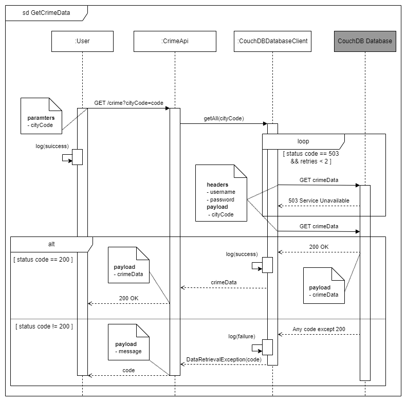

# CrimeViz Documentation


## Table of Contents
- [1 Introduction](#1-introduction)
   * [1.1 Purpose of CrimeViz]()
   * [1.2 Targeted Open Data Portals]()
   * [1.3 Technologie Used]()
- [2 Requirements](#2-requirements)
   * [2.1 Functional](#21-functional)
   * [2.2 Non-Functional](#22-non-functional)
   * [2.3 Use Cases](#23-use-cases)
     * [2.2.1 Diagram](#221-diagram)
     * [2.2.2 Descriptions](#222-descriptions)
- [3 System Architecture](#3-system-architecture)
   * [3.1 Overview](#31-overview)
- [4 Spring Backend](#4-spring-backend)
   * [4.1 Overview](#41-overview)
   * [4.2 Internal Structure](#42-internal-structure)
   * [4.3 Sequence Diagrams](#43-sequence-diagrams)
     * [4.3.1 GetRawCrimeData](#431-getrawcrimedata)
     * [4.3.2 GetCrimeData](#432-getcrimedata)
- [5 CouchDB Database](#5-couchdb-database)
   * [5.1 Overview](#51-overview)
   * [5.2 Database Structure](#52-database-structure)
   * [5.3 Unifrom Crime Document Structure](#53-unifrom-crime-document-structure)


## 1 Introduction
### 1.1 Purpose of CrimeViz
CrimeViz is a multi-framework, multi-language web application intended to visualize crime data for various cities in the US. The primary objective of this project is to learn more about the employed frameworks, languages, and technologies. That is seconded by the intention to explore the usefulness of the crime data offered by the various US cities, beginning with Los Angeles. As the project progresses, concrete domain-related questions will arise that can hopefully be answered by CrimeViz.

### 1.2 Targeted Open Data Portals
Over time, the intention is to add new cities with open data APIs.
These are the APIs currently targeted by CrimeViz:
- [Los Angeles](https://data.lacity.org/Public-Safety/Crime-Data-from-2020-to-Present/2nrs-mtv8/about_data)

### 1.3 Technologie Used
CrimeViz consists of multiple services. Each service uses a different framework and programming language:
- Spring Backend 
  - [Java openJDK 22](https://openjdk.org/projects/jdk/22/)
  - [Spring 6](https://docs.spring.io/spring-framework/reference/overview.html)
- CouchDB Database
  - [CouchDB 3.3.3](https://docs.couchdb.org/en/stable/index.html)
- Containerization and orchestration
  - [Docker](https://www.docker.com)


## 2 Requirements
### 2.1 Functional
These requirements describe CrimeViz’s features.
<table>
  <tbody>
    <tr>
      <th>ID</th>
      <th>Description</th>
    </tr>
    <tr>
      <td>CV_FR_01</td>
      <td>To get an overview, users should be able to receive crime data from a city they’ve chosen</td>
    </tr>
  </tbody>
</table>

<table>
  <tbody>
    <tr>
      <th>ID</th>
      <th>Description</th>
    </tr>
    <tr>
      <td>CV_FR_02</td>
      <td>CrimeViz should gather city crime data from external open data APIs</td>
    </tr>
  </tbody>
</table>

<table>
  <tbody>
    <tr>
      <th>ID</th>
      <th>Description</th>
    </tr>
    <tr>
      <td>CV_FR_03</td>
      <td>CrimeViz should transform crime data from open data APIs into a uniform crime data format before storing it in the database</td>
    </tr>
  </tbody>
</table>

<table>
  <tbody>
    <tr>
      <th>ID</th>
      <th>Description</th>
    </tr>
    <tr>
      <td>CV_FR_04</td>
      <td>CrimeViz should store crime data in a CouchDB database</td>
    </tr>
  </tbody>
</table>

### 2.2 Non-Functional
These requirements describe CrimeViz’s properties.
<table>
  <tbody>
    <tr>
      <th>ID</th>
      <th>Description</th>
    </tr>
    <tr>
      <td>CV_NFR_01</td>
      <td>To make CrimeViz modular and scalable, each service will be containerized via Docker</td>
    </tr>
  </tbody>
</table>

### 2.3 Use Cases
#### 2.2.1 Diagram

<p align="center" style="font-style:italic">Figure 1: Use case diagram depicting the use cases offered by CrimeViz</p>

There is currently only one identifiable use case: View Crime Data. It describes how a user can request crime data from the application for viewing.
While CrimViz fetches data from open data APIs and stores it in a database, this happens independently of any user interaction. That is why those processes do not appear in the diagram.
    
#### 2.2.2 Descriptions 
<table>
  <tbody>
    <tr>
      <td style="font-weight:bold">ID</td>
      <td>CV_UC_01</td>
    </tr>
    <tr>
      <td style="font-weight:bold">Name</td>
      <td>View Crime Data</td>
    </tr>
    <tr>
      <td style="font-weight:bold">Description</td>
      <td>A user requests crime data for viewing from CrimeViz</td>
    </tr>
    <tr>
      <td style="font-weight:bold">Goal</td>
      <td>Crime data has been fetched from the CouchDB Database and sent to the user</td>
    </tr>
    <tr>
      <td style="font-weight:bold">Actors</td>
      <td>User</td>
    </tr>
    <tr>
      <td style="font-weight:bold">Pre-conditions</td>
      <td>CrimeViz is running</td>
    </tr>
    <tr>
      <td style="font-weight:bold">Triggers</td>
      <td>The user requests crime data from a specific city via an HTTP GET request</td>
    </tr>
    <tr>
      <td style="font-weight:bold">Post-conditions</td>
      <td>The user can view the retrieved crime data</td>
    </tr>
    <tr>
      <td style="font-weight:bold">Basic Flow</td>
      <td>
        <ol>
          <li>To retrieve crime data to a chosen city, the user sends a GET request to CrimeViz’s CrimeAPI
            <ol type="a">
              <li>Spring Backend requests the crime data from CouchDB Database</li>
                <ol type="a">
                  <li>CouchDB Database gathers and sends the data with status code 200 to Spring Backend</li>
                </ol>
            </ol>
          </li>
          <li>Spring Backend sends the crime data and status code 200 to the user</li>
        </ol>
      </td>
    </tr>
    <tr>
      <td style="font-weight:bold">Alternative Flows</td>
      <td>
        In 1.a.a: CouchDB Database is unavailable (status code 503)
        <ol type="a">
          <li>Spring Backed retries the attempt (step 1.a in basic flow) twice in three-second intervals
            <ol type="a">
              <li>If the response’s status code remains something other than 200, Spring Backend sends a message to the user, informing them of the situation -> end use case</li>
              <li>If the response’s status code is 200 -> continue with step 1.a.a in basic flow </li>
            </ol>
          </li>
        </ol>
        In 1.a.a: CouchDB Database cannot find the requested data
        <ol type="a">
          <li>CouchDB Database sends a message to Spring Backed with the appropriate information</li>
          <li>Spring Backend sends a message to the user, informing them of the situation -> end use case</li>
        </ol>
        In 1.a: Spring Backend is unavailable
        <ol type="a">
          <li>The user gets an error message with status code 404 -> end use case</li>
        </ol>
      </td>
    </tr>
  </tbody>
</table>


## 3 System Architecture
### 3.1 Overview
CrimeViz consists of many services, each fulfilling a single duty. This is illustrated by the component diagram below. Each component built from scratch is depicted as a white box, therefore the implementation of these components is known. Each component for which the implementation is unknown is presented as a black box.
CrimeViz’s components, also called services, are containerized using Docker. 


<p align="center" style="font-style:italic">Figure 2: Component diagram depicting all major components of CrimeViz</p>

The CrimeViz application consists of two main components. 
The Spring Backend component houses the backend code for the application. As the name states, it is built using the Spring framework and written in Java. It has several tasks:
Requesting raw crime data objects (individually called RawCrime) from Crime Data API
Transforming the raw crime data into uniform crime data objects (individually called Crime)
Storing the Crime objects in CouchDB Database
Retrieving Crime objects from CouchDB Database
Offering the Crime objects via an API to any clients
The CouchDB Database component is a CouchDB instance that houses the Crime objects. It stores these objects and sends them back to Spring Backend. This component is not created from scratch, therefore it is a black box even though it lies within CrimeViz’s boundaries.
The Crime Data API component is an external API that lies outside the boundaries of CrimeViz. This is why it is considered a black box. It is worth noting that this is a placeholder for various open data portals. Since each is treated similarly, there is no need to list them individually.


## 4 Spring Backend
### 4.1 Overview
The Spring Backend component houses the backend code for the application. As the name states, it is built using the Spring framework and written in Java. It has several tasks:
Requesting raw crime data objects (individually called RawCrime) from Crime Data API
Transforming the raw crime data into uniform crime data objects (individually called Crime)
Storing the Crime objects in CouchDB Database
Retrieving Crime objects from CouchDB Database
Offering the Crime objects via an API to any clients

### 4.2 Internal Structure

<p align="center" style="font-style:italic">Figure 3: Component diagram depicting all major components that are part of the Spring Backend component shown in Figure 2</p>

Spring Backend is comprised of four components. 
RawCrimeApiClient houses the logic that sends requests to Crime Data API (depicted in Figure 2). After this, it receives crime data as RawCrime objects. These are passed to RawCrimeToCrimeMapper.
The RawCrimeToCrimeMapper component is a component comprised of logic that maps RawCrime objects to Crime objects. This is a placeholder. Since each crime data API offers data in different formats, there is a mapper for each one. After the mapping, the data is passed to the CouchDBCrimeDatabaseClient. 
The CouchDBCrimeDatabaseClient component is the gateway to the CouchDB Database component (depicted in Figure 2). It sends and retrieves Crime objects to and from the database. It is used by RawCrimeToCrimeMapper and CrimeApi for these purposes.
The CrimeApi component exposes an API to the internet, which one can use to retrieve Crime objects. 

### 4.3 Sequence Diagrams
#### 4.3.1 GetRawCrimeData

<p align="center" style="font-style:italic">Figure 4: Sequence diagram showing the process of how CirmeViz retrieves raw crime data from Crime Data API</p>

Please note that the Los Angeles open data portal was used as a reference for the API’s responses and status codes. The diagram will be adapted as new APIs are targeted. 
It starts with a GET request from RawCrimeApiClient to Crime Data API. Depending on the API’s implementation, an API key or a username and password combination will be sent in the request via the header section. There is a possibility that the API sends back a code that warrants a retry. Here the status code 202 could be such a case. Retries are attempted once every three seconds, the maximum being three attempts. 
After another unsuccessful attempt, RawCrimeApiClient logs a failure message. If the third attempt yields a status code 200 and a crime data payload, RawCrimeApiClient logs a success message before passing the payload to RawCrimeToCrimeMapper.
The mapper maps the raw crime data objects to uniform crime data objects. After this, CouchDBDatabaseClient sends the data for storage to CouchDB Database. Similar to how it is done with Crime Data API, there is a retry mechanism for this interaction (same amount of attempts and time intervals). The status code that warrants a retry is 503 (based on the CouchDB documentation). Basic auth is used for authentication purposes. If a third retry yields a 201 status code the client will log a success message, if not, it will log a failure message instead.

#### 4.3.2 GetCrimeData

<p align="center" style="font-style:italic">Figure 5: Sequence diagram depicting the process of how a user gets crime data from CrimeViz</p>

First, the user sends a GET request to CrimeApi. The target city’s code must be present as a URL parameter. This city code is then sent to CouchDBDatabaseClient.
Next, CouchDBDatabaseClient sends a GET request to CouchDB Database to fetch the data. The status code that warrants a retry is 503 (based on the CouchDB documentation). A maximum of three retries in three-second intervals are attempted. Basic auth will be used for authentication purposes and the city code will be used in the payload to get the desired data. If a third retry yields a status code unequal to 200, the client logs a failure message. Then it will throw an exception so CrimeApi can inform the user of the situation. If the response is a status code 200 with a data payload, CouchDBDataBaseClient logs a success message before sending the payload to CrimeApi. 
Finally, CrimeApi forwards the data to the user.


## 5 CouchDB Database
### 5.1 Overview
The database houses all the data relevant to CrimeViz. Currently, this only involves crime data. 
As mentioned in the previous chapter, once Spring Backend fetches the data from Crime Data API, it maps it to a uniform Crime object. This is done for two reasons:
Not every field in the raw data is relevant
Different APIs offer differently structured data. It’s easier to map all data to a uniform format to make processing easier
It is also important to note that CouchDB stores documents in JSON format.

### 5.2 Database Structure
There exists only one database called ‘crime’, and it contains only crime data.

### 5.3 Unifrom Crime Document Structure
This is what the uniform crime document structure looks like:
```
{
  "_id": "a5291e36-2628-406c-8eba-47ad81a4aac6",
  "_rev": "1-ca2f455f4397e593eda6f5d566e5e9cb",
  "city": "la",
  "crime": {
    "general": {
      "reportDate": "05/14/2024",
      "occurrenceData": "05/14/2024",
      "occurrenceTime": "13:00",
      "status": "reported"
    },
    "offence": {
      "type": "assault",
      "weapon": "fist",
      "premise": "ally"
    },
    "victim": {
      "age": "20",
      "sex": "male",
      "descent": "white"
    },
    "geological": {
      "latitude": "0.000",
      "longitude": "0.000",
      "location": "90 Victoria Street"
    }
  }
}
```

The following table describes the fields:
<table>
  <tbody>
    <tr>
      <th>Field</th>
      <th>Description</th>
    </tr>
    <tr>
      <td>_id</td>
      <td>UUID for the document</td>
    </tr>
    <tr>
      <td>_rev</td>
      <td>Revision of the document</td>
    </tr>
    <tr>
      <td>city</td>
      <td>The City in which the crime took place</td>
    </tr>
    <tr>
      <td>crime.general.reportDate</td>
      <td>The date on which the crime was reported</td>
    </tr>
    <tr>
      <td>crime.general.occurrenceDate</td>
      <td>The date on which the crime occurred</td>
    </tr>
    <tr>
      <td>crime.general.occurrenceTime</td>
      <td>The time at which the crime occurred</td>
    </tr>
    <tr>
      <td>crime.general.status</td>
      <td>The status of the investigation</td>
    </tr>
    <tr>
      <td>crime.offence.type</td>
      <td>The type of crime committed</td>
    </tr>
    <tr>
      <td>crime.offence.weapon</td>
      <td>The weapon used</td>
    </tr>
    <tr>
      <td>crime.offence.premise</td>
      <td>The premise of the crime</td>
    </tr>
    <tr>
      <td>crime.victim.age</td>
      <td>The victim’s age</td>
    </tr>
    <tr>
      <td>crime.victim.sex</td>
      <td>The victim’s sex</td>
    </tr>
    <tr>
      <td>crime.victim.descent</td>
      <td>The victim’s ethnicity</td>
    </tr>
    <tr>
      <td>crime.geological.latitude</td>
      <td>The crime’s latitude coordinate</td>
    </tr>
    <tr>
      <td>crime.geological.longitude</td>
      <td>The crime’s longitude coordinate</td>
    </tr>
    <tr>
      <td>crime.geological.location</td>
      <td>The location of the crime</td>
    </tr>
  </tbody>
</table>
